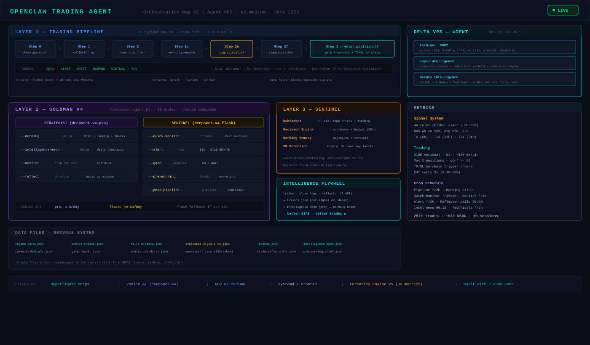

# OpenClaw Trading Agent

> Autonomous crypto perp trading bot on Hyperliquid. 44 institutional-grade signal rules, Goldman v4 intelligence layer, real-time sentinel monitoring — all running 24/7 on GCP.



---

## Architecture

OpenClaw runs on a dedicated GCP e2-medium VPS (Agent) with 3 processing layers:

| Layer | Engine | Calls/day | Role |
|---|---|---|---|
| **Trading Pipeline** | `run_pipeline.sh` cron */2h | 0 LLM | 8-step sequential: collect → forensics → velocity → signals → BIAS filter → execute |
| **Goldman v4 Intelligence** | `financial_agent.py` (10 modes) | 50-70 Venice | Two-model architecture: deepseek-v4-pro (strategist) + flash (sentinel) |
| **Agentic Sentinel** | `decision_engine.py` + WebSocket | ~40-60 flash | Event-driven position monitoring, SR approach detection, working memory |

### Pipeline (every 2 hours)

```
Step 0   check_position_hl.py       slot available?
Step 0b  check_balance.py           Venice API credits
Step 1   collector.py               market data (6 tokens)
Step 2   report_builder.py          forensic metrics (30/token)
Step 2c  velocity_engine.py         composites, RSI, z-scores
Step 2e  signal_evaluator_v2.py     44 OOS-validated rules
Step 2f  signal_tracker.py          BIAS directional filter
Step 3   enter_position_hl.py       gate → execute → TP/SL on-chain
```

### Goldman v4 — Intelligence Layer

Two-model architecture: **pro decides, flash watches**.

| Mode | Model | Schedule | Role |
|---|---|---|---|
| `--morning` | pro | 07:00 UTC | BIAS + conviction + token ranking + thesis |
| `--intelligence-memo` | pro | 00:15 UTC | Daily strategic synthesis (after reflector) |
| `--monitor` | pro/flash | */1h | Position verdicts: CUT / TIGHTEN_SL / WIDEN_TP / HOLD |
| `--reflect` | pro | on close | Compare thesis vs outcome → lesson |
| `--quick-monitor` | flash | */15min | Fast sentinel, phase-proportional to horizon |
| `--alert` | flash | */2h | BTC momentum → BIAS_UPDATE |
| `--gate` | flash | pipeline | GO/WAIT decision ($100 sizing) |
| `--pre-morning` | flash | 06:55 UTC | Overnight brief for morning strategist |
| `--post-pipeline` | flash | pipeline | Trade vs BIAS/thesis coherence check |

### Agentic Sentinel

Event-driven monitoring via Hyperliquid WebSocket:

- **Real-time events**: price ticks, funding changes, SR approach detection
- **Decision engine**: deterministic routing with cooldowns, budget 150 calls/day
- **Working memory**: positions, market assessment, recent verdicts
- **Actions**: escalate to pro, emergency alerts, position management

### Intelligence Flywheel

```
trades → enriched close logs → reflector (daily, 0 API)
  → lessons.json (per-signal WR, regime correlation, decay detection)
  → intelligence memo (pro daily at 00:15)
  → morning brief (pro at 07:00)
  → better BIAS + ranking + thesis
  → better trades
```

## Signal System

**44 institutional-grade rules** (session 9), validated with Fisher exact test + Benjamini-Hochberg FDR:
- OOS win rate >= 50%, average R:R ~2.5
- 6 tokens: AERO, AIXBT, BRETT, MORPHO, VIRTUAL, VVV
- 3 horizons: T6 (6h), T12 (12h), T24 (24h)

Per-token TP/SL (backtest-optimized):

| Token | TP | SL | Timeout |
|---|---|---|---|
| AERO | +3.5% | -1.4% | 14h |
| AIXBT | +8.5% | -2.6% | 28h |
| BRETT | +3.3% | -2.3% | 14h |
| MORPHO | +8.4% | -2.6% | 28h |
| VIRTUAL | +5.3% | -2.9% | 52h |
| VVV | +6.3% | -2.5% | 28h |

## Trading Rules

- $100 notional per trade (5x leverage, ~$20 margin)
- Max 2 concurrent positions
- Confidence >= 55 to pass gate
- BIAS directional filter (blocks opposite signals)
- Hard blacklist: tokens WR < 25% (n>=5), directions WR < 20% (n>=10)
- TP/SL placed on-chain as trigger orders at entry
- CUT retry: 3 attempts with escalating slippage (5% → 10% → 15%)

## Data Context

The agent receives enriched context from Delta VPS (Hermes intelligence):

- **Terminal :5002** → prices (32 tokens), funding rates, HL data, anomalies
- **/api/intelligence** → composite scores, token tier (A/B/C), composite regime
- **Token technicals** → S/R levels, ATR, trend structure, volume profile (computed locally)
- **OHLCV candles** → 1h/4h/1d for gate and monitor decisions

### Data Files (nervous system)

| File | Written by | Read by |
|---|---|---|
| `regime_card.json` | morning + all modes | pipeline (BIAS filter) |
| `active_trades.json` | enter_position | monitor, sentinel |
| `fills_history.json` | manage_positions | reflector, morning |
| `evaluated_signals_v2.json` | signal_evaluator | pipeline, gate |
| `lessons.json` | reflector (daily) | intelligence memo |
| `intelligence_memo.json` | pro (00:15 UTC) | morning |
| `token_technicals.json` | token_technicals (*/2h) | all LLM modes |
| `dynamics/*.json` | velocity_engine | pipeline, monitor |

## Performance

| Metric | Value |
|---|---|
| Total trades | 252+ |
| Capital | ~$32 USDC |
| Win rate (14d) | ~36% |
| Positions hold | 14-52h (horizon-dependent) |
| Pipeline frequency | every 2 hours |
| LLM calls/day | ~50-70 Venice |

## Cross-VPS Architecture

```
┌─────────────────────┐         VPC 10.132.0.5        ┌─────────────────────┐
│   AGENT VPS         │◄────────────────────────────── │   DELTA VPS         │
│   (Execution)       │    terminal :5002              │   (Intelligence)    │
│                     │    /api/intelligence            │                     │
│  Pipeline */2h      │                                │  12 CMD scripts     │
│  Goldman v4 (10)    │                                │  3 Gemma scripts    │
│  Sentinel (live)    │                                │  Hermes Sentinel    │
│  Reflector (daily)  │                                │  Wiki (13 sectors)  │
└─────────────────────┘                                └─────────────────────┘
```

---

*Built with Claude Code across 19 sessions. Pure Python, no frameworks.*
